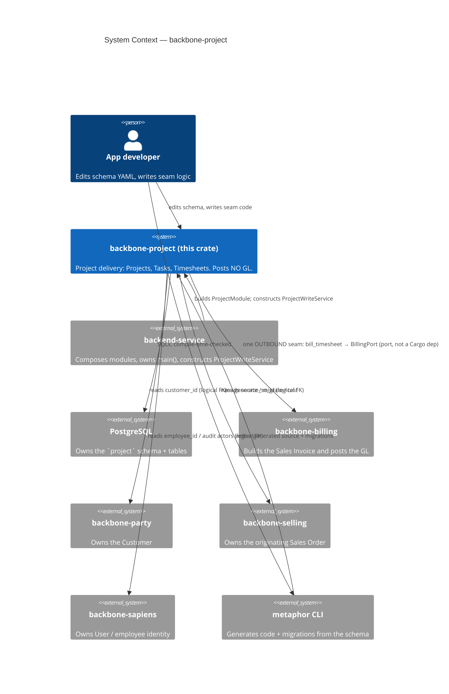
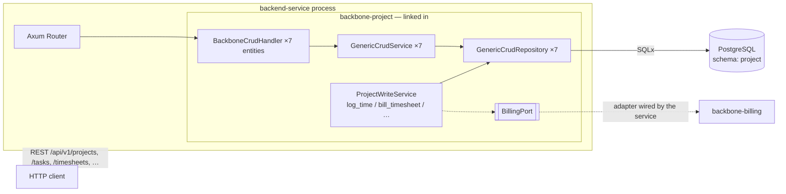
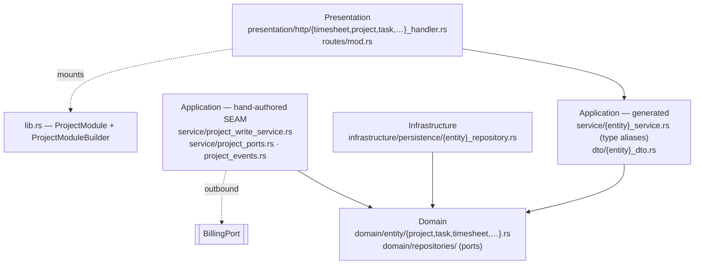
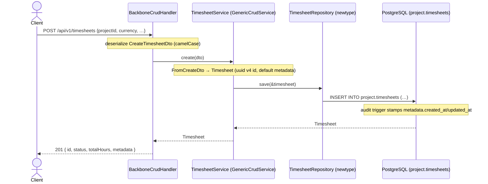

<!-- Reader: Maintainer · Mode: Explanation -->
# Architecture

`backbone-project` is a **library crate** that owns one bounded domain — **project delivery** — as
four DDD layers. It does not run on its own: a `backend-service` composes it, hands it a database
pool, and mounts its router. Almost everything in `src/` is generated from the schema YAML; the
one hand-authored area is the **billing seam** (`src/application/service/project_*.rs`), which lives
inside regen-safe regions. This page shows the system top-down (C4), then traces the module's most
characteristic operation — **submitting a timesheet and billing it** — end to end.

## 1. Context

Who uses this module, and what it depends on. Every dependency on a sibling module is a **logical
reference** (a UUID column, no database constraint), never a linked-in table.



*What to notice: the module is a **dependency**, never an entrypoint. Every arrow to a sibling is
inbound-read (party, selling, sapiens) **except one** — the outbound seam to billing, and even that
is a **port**, not a Cargo edge. `backbone-billing` appears nowhere in the shipped library's
dependency tree (it is a `[dev-dependencies]` path used only by the seam's integration test).*

## 2. Containers

The module compiles **into** the service binary; there is no separate module process. It contributes
a plain Axum `Router` and, for the seam, a hand-constructed `ProjectWriteService`.



*What to notice: two paths into Postgres. The **generated CRUD path** (top) gives raw table access —
12 endpoints per entity — and is the only path that has an HTTP route today. The **write-service
path** (`ProjectWriteService`) carries the real domain verbs (roll-up, transition gates, the billing
hand-off) and is invoked **directly by the composing service**, not over HTTP. The dashed `BillingPort`
is the only outbound edge, and the service supplies its implementation.*

## 3. Components / modules — the DDD 4-layer shape

Dependencies point **inward only**. Domain depends on nothing.



| Layer | Directory | Holds (in this module) | May depend on |
|-------|-----------|------------------------|---------------|
| **Domain** | `src/domain/` | 7 entities (`Project`, `Task`, `Timesheet`, `TimesheetDetail`, `ActivityType`, `ProjectTemplate`, `ProjectTemplateTask`), their typed ids + `apply_patch` + audit accessors, the enums (`ProjectType`, `ProjectStatus`, `TaskStatus`, `TimesheetStatus`), repository **traits** (ports) | nothing |
| **Application — generated** | `src/application/service/`, `src/application/dto/` | 7 `…Service` **type aliases** over `GenericCrudService`; the Create/Update/Patch/Response DTOs and their conversions | domain |
| **Application — seam** (hand-authored) | `src/application/service/project_write_service.rs`, `project_ports.rs`, `project_events.rs` | `ProjectWriteService` (the real verbs), the `BillingPort` trait + wire DTOs, the `ProjectEvent` types + `ProjectEventSink` | domain |
| **Infrastructure** | `src/infrastructure/persistence/` | 7 repository **newtypes** over `GenericCrudRepository<Entity, SoftDelete>` (`TABLE_NAME = "project.<table>"`, `impl_crud_repository!`) | domain, application |
| **Presentation** | `src/presentation/`, `src/routes/` | `create_<entity>_routes()` wiring `BackboneCrudHandler`; the stateless/stateful route composers | application |
| **Composition** | `src/lib.rs` | `ProjectModule` / `ProjectModuleBuilder`, public re-exports | all layers (it is the root) |

Three subtleties worth internalizing:

- **The composition root is `src/lib.rs`, not `src/module.rs`.** `ProjectModule` and its builder are
  defined inline in [`lib.rs`](../../src/lib.rs). `src/module.rs` is an orphaned skeleton stub (a
  `Module` wrapping an `Example` service) that `lib.rs` never declares — ignore it.
- **There are two `TimesheetRepository`-shaped things per entity.** The domain layer defines a repo
  **trait** (the *port*); the infrastructure layer defines a **newtype `struct`** that `Deref`s to
  `GenericCrudRepository` (the *adapter*). The port is the contract; the adapter is the Postgres
  implementation.
- **The seam is real code, not scaffolding — but it has no HTTP route.** `ProjectWriteService` is
  fully implemented and integration-tested, yet it is **not** a field on `ProjectModule` and has no
  generated handler. A composing service constructs it (`ProjectWriteService::new(pool)`) and calls
  its verbs. See [§4](#4-data--control-flow) and the [Maintainer Guide](05-maintainer-guide.md#the-billing-seam-the-write-service-pattern).

## 4. Data & control flow

Two flows matter. The first is the generated CRUD path (identical for all 7 entities). The second is
the module's reason to exist: logging billable time and handing it to billing.

### 4a. A generated CRUD write — `POST /api/v1/timesheets`



*What to notice:* this path is **pure table access**. It writes a `project.timesheets` row directly
and **bypasses every domain rule** — no roll-up onto the project, no `draft → submitted` gate. That
is exactly why `ProjectModule::all_crud_routes()` is documented as the **unguarded** surface, and why
the real write path is the write-service below.

### 4b. The domain flow — log time, then bill it (the outbound seam)

This is the operation ADR-0004 exists for. It runs through `ProjectWriteService`, not over HTTP.

```mermaid
sequenceDiagram
    actor Service as backend-service
    participant W as ProjectWriteService
    participant DB as PostgreSQL (project.*)
    participant Port as BillingPort (impl by the service)
    participant Bill as backbone-billing

    Service->>W: log_time(project, lines[])
    Note over W: one tx — INSERT submitted timesheet + details,<br/>snapshot billing_rate/costing_rate per line,<br/>roll total_billable/total_costing onto project WHERE status='open'
    W->>DB: COMMIT
    Service->>W: bill_timesheet(timesheet_id)
    W->>Port: create_service_invoice(InvoiceFromTimesheet)
    Port->>Bill: build Sales Invoice, post GL (Dr A/R · Cr Service Revenue · Cr PPN)
    Bill-->>Port: InvoiceAck { invoice_id }  (idempotent on TS-<id>)
    Port-->>W: InvoiceAck
    Note over W: gate submitted → billed;<br/>record invoice_id; roll total_billed (same tx)
    W->>DB: COMMIT
    W-->>Service: billed
```

*What to notice:*
- **Rates are snapshotted at log time.** Each `timesheet_detail` copies the `ActivityType`'s
  `billing_rate` + `costing_rate` when logged, so a later rate change never rewrites logged history.
- **The hand-off is idempotent + transition-gated.** A timesheet bills **once** — the invoice is
  keyed `TS-<id>`, and the `submitted → billed` gate plus the `total_billed_amount` roll-up commit in
  the *same* transaction. A retry returns the existing invoice.
- **project posts no GL.** Money moves only when billing takes over the billable timesheet. project
  records the echoed `invoice_id` and marks the sheet `BILLED`; the ledger is billing's job.
- **The reverse gear exists.** `cancel_timesheet` (`submitted → cancelled`) reverses a mis-logged
  sheet's amounts off the roll-up in the same open-project-gated tx; a `billed` sheet cannot be
  cancelled.

## Where persistence semantics come from

- **Own schema per module** → `schema: project` in [`index.model.yaml`](../../schema/models/index.model.yaml)
  makes migrations emit `CREATE SCHEMA project` and qualify every table as `project.<table>`
  (`project.projects`, `project.timesheets`, …), so no two modules collide on a table name.
- **Soft delete** is structural: `config.soft_delete: true` → `GenericCrudRepository<Entity, SoftDelete>`
  → the `soft_delete`/`restore`/`empty_trash`/`list_deleted` endpoints operate on `metadata.deleted_at`.
- **Audit** (`config.audit: true`) → the `metadata` JSONB column (`created_at`, `updated_at`,
  `deleted_at`, `created_by`, `updated_by`, `deleted_by`). Timestamps are set by a **Postgres trigger**
  (`migrations/*_add_audit_triggers.up.sql`), so they hold even for writes that bypass the service; the
  `*_by` actors are logical FKs to `sapiens.User.id`.

## Key decisions

- [ADR-0001](adr/adr-0001-schema-yaml-ssot.md) — schema YAML is the single source of truth.
- [ADR-0002](adr/adr-0002-generic-crud.md) — CRUD is inherited from generics, not written per entity.
- [ADR-0003](adr/adr-0003-custom-markers.md) — regen-safety via CUSTOM markers and `user_owned`.
- [ADR-0004](adr/adr-0004-project-boundary-billing-seam.md) — the project boundary and the one
  outbound timesheet→billing seam (this module's defining decision).

---

Next: [Maintainer Guide](05-maintainer-guide.md) — how to add an entity, and how to extend the seam,
without breaking the machine.
